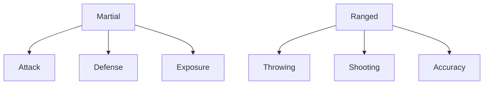
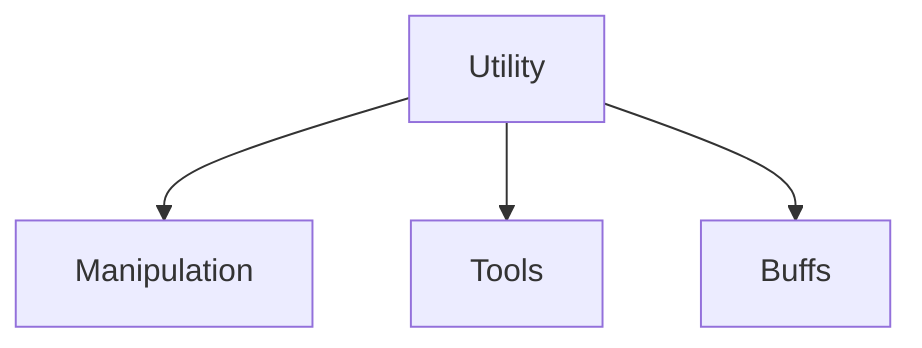
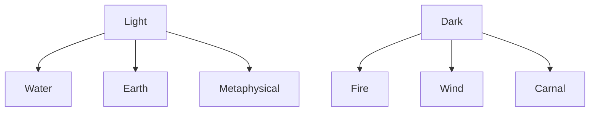

# That Game Character Prototype

## Character

Level: 40 (current max)

General Unlocks: mount, some teleports, guild, etc. (he can do most of the late-game things)

Secondary Job Unlocked at level 20(?)

Max Job Cap: 40

Max Weapon Cap: 80 (2x char level)

Custom Class Name: Big Boi Shieldman (this would be 1 of 5 similar slots a character could have)

## *Brief* Equipment/Class Description

The idea here is just your good ole fashioned sword and board buddy. This one might be a little too heavy on the sword, and thus you’re likely to have to heal him a bit more…but hey, he does give you some nice buffs! 

## Incidental Glossary

#### Note: these are temporary/changeable and only defined for consistency here

ability: an activated effect

(weapon) skill: a damaging weapon effect

buff: temporary party increase (with a range)

cool down/cd: a personal activated effect, temporary and personal

aura: permanent party increase (with a range)

hit: applies to the next skill used

aoe: I’m not defining this one…

## Job Levels

#### Note: **bold** items are activated, otherwise referring to traits

### Offensive (insert gooder name here plz) Level 30

| Level  | Ability(%5)/Trait Name                   | Ability Description                         |
| ------ | ---------------------------------------- | ------------------------------------------- |
| 1      | Trait of the Awesome Hitter of Stuff I   | martial weapon damage increase              |
| 2      | Trait of the Awesome Hitter of Stuff II  | martial weapon damage increase              |
| 3      | Trait of the Awesome Hitter of Stuff III | martial weapon damage increase              |
| 4      | Trait of the Awesome Hitter of Stuff IV  | martial weapon damage increase              |
| **5**  | **BIG HITTER!**                          | **next hit double effect**                  |
| 6      | Invitemepls Trait I                      | party physical damage increase              |
| 7      | Invitemepls Trait II                     | party physical damage increase              |
| 8      | Invitemepls Trait III                    | party physical damage increase              |
| 9      | Invitemepls Trait IV                     | party physical damage increase              |
| **10** | **Welcome to the Party Ability**         | **aoe damage buff**                         |
| 11     | U Even Crit Bro? I                       | martial weapon critical rate increase       |
| 12     | U Even Crit Bro? II                      | martial weapon critical rate increase       |
| 13     | U Even Crit Bro? III                     | martial weapon critical rate increase       |
| 14     | U Even Crit Bro? IV                      | martial weapon critical rate increase       |
| **15** | **I Cans Hit HARDER**                    | **increased critical cd**                   |
| 16     | iWeapon I                                | party weapon level aura (for passives only) |
| 17     | iWeapon II                               | party weapon level aura (for passives only) |
| 18     | iWeapon III                              | party weapon level aura (for passives only) |
| 19     | iWeapon IV                               | party weapon level aura (for passives only) |
| **20** | **U Miss Bro?**                          | **party accuracy aura**                     |
| 21     | RAWR Passive I                           | party damage increase                       |
| 22     | RAWR Passive II                          | party damage increase                       |
| 23     | RAWR Passive III                         | party damage increase                       |
| 24     | RAWR Passive IV                          | party damage increase                       |
| **25** | **From Not Invited To Snubbing U**       | **party damage aura**                       |
| 26     | Ah I                                     | martial weapon lifelink                     |
| 27     | Ah II                                    | martial weapon lifelink                     |
| 28     | Ah III                                   | martial weapon lifelink                     |
| 29     | Ah IV                                    | martial weapon lifelink                     |
| **30** | **“Stayin Alive”**                       | **damage/lifelink buff**                    |

### Defensive

| Level  | Ability(%5)/Trait Name           | Ability Description             |
| ------ | -------------------------------- | ------------------------------- |
| 1      | Protector I                      | party physical defense increase |
| 2      | Protector II                     | party physical defense increase |
| 3      | Protector II                     | party physical defense increase |
| 4      | Protector IV                     | party physical defense increase |
| **5**  | **Nice damage…can I have some?** | **cover party member buff**     |
| 6      | Big Boi I                        | personal defense increase       |
| 7      | Big Boi II                       | personal defense increase       |
| 8      | Big Boi III                      | personal defense increase       |
| 9      | Big Boi IV                       | personal defense increase       |
| **10** | **Am I supposed to say ow?**     | **defensive cd**                |

(Our sword-lusty friend could have had…)

| Level  | Ability(%5)/Trait Name  | Ability Description              |
| ------ | ----------------------- | -------------------------------- |
| 11     | HEYYYY YOU GUYYYYYYS I  | enmity generation                |
| 12     | HEYYYY YOU GUYYYYYYS II | enmity generation                |
| 13     | HEYYYY YOU GUYYYYYYS II | enmity generation                |
| 14     | HEYYYY YOU GUYYYYYYS IV | enmity generation                |
| **15** | **I Got U**             | **enmity+(self)/-(others) aura** |

### Offensive/Defensive Combo Levels

| Level  | Ability(%5)/Trait Name        | Ability Description                  |
| ------ | ----------------------------- | ------------------------------------ |
| 1      | I am Shield Man I             | shield defense bonus                 |
| 2      | I am Shield Man II            | shield defense bonus                 |
| 3      | I am Shield Man III           | shield defense bonus                 |
| 4      | I am Shield Man IV            | shield defense bonus                 |
| **5**  | **Shield Bash** (what a name) | **shield bash-y thing**              |
| 6      | Deafening Defender I          | aoe reduce others’ enmity generation |
| 7      | Deafening Defender II         | aoe reduce others’ enmity generation |
| 8      | Deafening Defender III        | aoe reduce others’ enmity generation |
| 9      | Deafening Defender IV         | aoe reduce others’ enmity generation |
| **10** | **Aggrivate/Alleviate**       | **enmity toggle aura**               |

(again speculative abilities he could’ve gained with fewer points in the offensive job)

| Level  | Ability(%5)/Trait Name | Ability Description               |
| ------ | ---------------------- | --------------------------------- |
| 11     | Aggressive Bastion I   | shield defense modified to attack |
| 12     | Aggressive Bastion II  | shield defense modified to attack |
| 13     | Aggressive Bastion III | shield defense modified to attack |
| 14     | Aggressive Bastion IV  | shield defense modified to attack |
| **15** | **Sharp Shield**       | **defensive bonus to attack**     |

## Weapon Skills

#### Notes: %5 level stuff here is activated, and I kinda dispatched with names as its getting late and I’m tired, but think hard slash, blinding swing, sword sweep, yadda yadda…

### Sword

| Level  | Skill                 | Level  | Skill                            |
| ------ | --------------------- | ------ | -------------------------------- |
| 1      | passive sword acc/dmg | 41     | (passive dual wield unlock?)     |
| 2      | passive sword acc/dmg | 42     | passive sword acc/dmg            |
| 3      | passive sword acc/dmg | 43     | passive sword acc/dmg            |
| 4      | passive sword acc/dmg | 44     | passive sword acc/dmg            |
| **5**  | **combo 1-1**         | **45** | **special 1**                    |
| 6      | passive sword acc/dmg | 46     | passive sword acc/dmg            |
| 7      | passive sword acc/dmg | 47     | passive sword acc/dmg            |
| 8      | passive sword acc/dmg | 48     | passive sword acc/dmg            |
| 9      | passive sword acc/dmg | 49     | passive sword acc/dmg            |
| **10** | **combo 1-2**         | **50** | **combo 2-1**                    |
| 11     | passive sword acc/dmg | 51     | passive sword acc/dmg            |
| 12     | passive sword acc/dmg | 52     | passive sword acc/dmg            |
| 13     | passive sword acc/dmg | 53     | passive sword acc/dmg            |
| 14     | passive sword acc/dmg | 54     | passive sword acc/dmg            |
| **15** | **combo 1-3**         | **55** | **combo 2-2**                    |
| 16     | passive sword acc/dmg | 56     | passive sword acc/dmg            |
| 17     | passive sword acc/dmg | 57     | passive sword acc/dmg            |
| 18     | passive sword acc/dmg | 58     | passive sword acc/dmg            |
| 19     | passive sword acc/dmg | 59     | passive sword acc/dmg            |
| **20** | **utility 1**         | **60** | **multi-finisher 1** (c2 or ac2) |
| 21     | passive sword acc/dmg | 61     | passive sword acc/dmg            |
| 22     | passive sword acc/dmg | 62     | passive sword acc/dmg            |
| 23     | passive sword acc/dmg | 63     | passive sword acc/dmg            |
| 24     | passive sword acc/dmg | 64     | passive sword acc/dmg            |
| **25** | **aoe combo 1-1**     | **65** | **special 2**                    |
| 26     | passive sword acc/dmg | 66     | passive sword acc/dmg            |
| 27     | passive sword acc/dmg | 67     | passive sword acc/dmg            |
| 28     | passive sword acc/dmg | 68     | passive sword acc/dmg            |
| 29     | passive sword acc/dmg | 69     | passive sword acc/dmg            |
| **30** | **aoe combo 1-2**     | **70** | **aoe combo 2-1**                |
| 31     | passive sword acc/dmg | 71     | passive sword acc/dmg            |
| 32     | passive sword acc/dmg | 72     | passive sword acc/dmg            |
| 33     | passive sword acc/dmg | 73     | passive sword acc/dmg            |
| 34     | passive sword acc/dmg | 74     | passive sword acc/dmg            |
| **35** | **aoe combo 1-3**     | **75** | **aoe combo 2-2**                |
| 36     | passive sword acc/dmg | 76     | passive sword acc/dmg            |
| 37     | passive sword acc/dmg | 77     | passive sword acc/dmg            |
| 38     | passive sword acc/dmg | 78     | passive sword acc/dmg            |
| 39     | passive sword acc/dmg | 79     | passive sword acc/dmg            |
| **40** | **utility 2**         | **80** | **multi-finisher 2** (c2 or ac2) |

## Thoughts

There’s certainly openness for branching here, but I think it’d be best to just get this designed for 5 jobs and a handful of weapons to start with, and then we can start getting fancy.

I like this design because it imposes no sense of class on the character or player, and they can essentially free form for whatever they’d like. It’d even be cool to let them save this slot (among their 5) as a custom class name, perhaps displayed when inspected. Obviously there are bad combinations, such as taking offensive and wielding a magic staff…but that’s for the player to enjoy (while sucking) or learn from.

Weapons are levelled based on usage while I like the idea of giving a flat % split to any incidental jobs whenever the character gains experience. For now we only have either solo job or duo job, but due to the combination if you duo job you don’t really lose anything, and in fact you gain some interesting combination skills which may or may not be worth it. 

It would be important for hardcore multi-classers (looking at you Sim) to keep tracking experience even when the character level is max, as job levels can still be obtained, allowing for other class slots to occupy something like a fiendish dark-magic backstabbing rogue or a druidic bow-wielding healer.

Lastly there’s a lot more room for improvement and expansion here. The idea was to get a basic character down to show that even for the most basic guy, there’s a lot going on. We could explore more frequent actives for either jobs or weapons, more/different jobs, and how weapons/magic interact vis-a-vis elemental grips or whatever else.

## Future

### Job Trees

